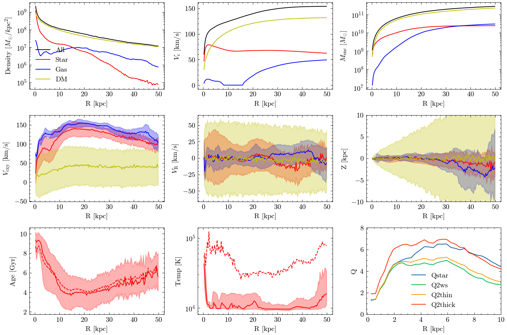
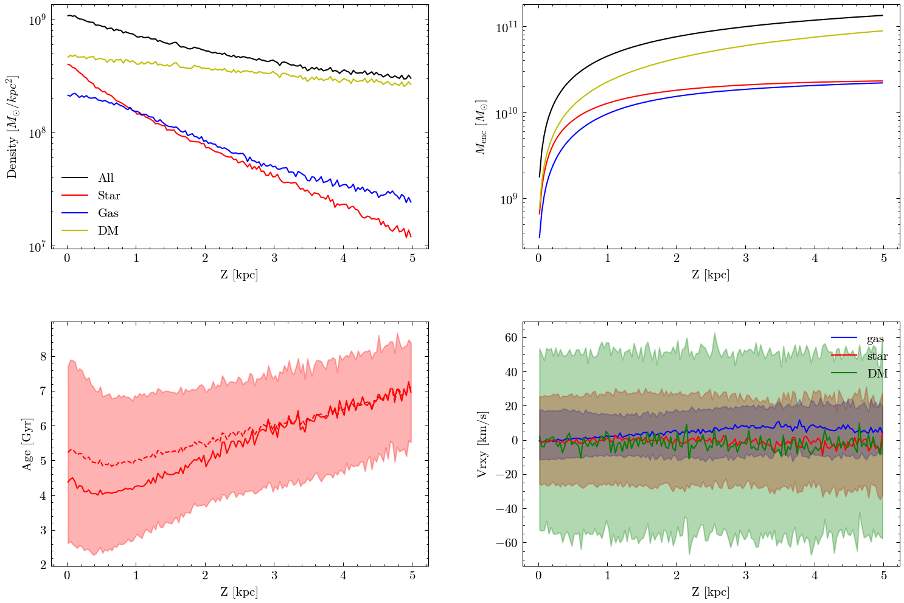

## Introduction
AnastrisTNG is a python package for processing and analyzing the cosmological simulation [IllustrisTNG](https://www.tng-project.org/).
Supports TNG50, TNG100, TNG300, and **TNG-Cluster (recently released)**.

## Installation

Python version >= 3.8:
```
git clone https://github.com/wx-ys/AnastrisTNG.git
```

Install this in editable mode.
```
cd AnastrisTNG
pip install -e .
```
AnastrisTNG uses the following python packages:

* numpy, scipy
* pynbody >=1.4.0
* h5py
* tqdm
* six
* numba


## Feature


* __Supports TNG50, TNG100, TNG300, and **TNG-Cluster (recently released)**, including all data units.__

* __Quickly explore galaxy evolution history, merger history, halo evolution history.__

* __Analyze galactic interactions under the same coordinate system.__

* __Analyze groupcatalog, trace gas particles, etc__

* __Easy to view the radial and vertical distribution of the constituent properties of galaxies, including 3D properties and 2D projection properties.__
<center>
<figure>
      
      
</center>
</figure>


* __Quickly (tens of seconds) check galaxy star formation history over time and space (not public). If you're interested, please contact me lushuai@stu.xmu.edu.cn.__

## Usage


```python
from AnastrisTNG import TNGsimulation 
BasePath = 'filepath'       
snap=99  #snapshot

Snapshot=TNGsimulation.Snapshot(BasePath,snap) # use the data of snapshot99

Snapshot.load_halo(400)    #load a halo(id=400)
Snapshot.load_subhalo(8)    #load a subhalo(id=8)

# load a single subhalo
sub = Snapshot.load_particle(ID=10, groupType='Subhalo', decorate=True)
sub.physical_units() #in physical unit
sub.face_on(alignwith='star',rmax=8) # face on, based on stellar angular momentum.

```

See [examples](examples) for more details,

## Maintainers

[@wx-ys](https://github.com/wx-ys).


## License

[MIT](LICENSE) © Shuai Lu

## Acknowledgments
* [illustris_python](https://github.com/illustristng/illustris_python)
* [pytreegrav](https://github.com/mikegrudic/pytreegrav)
* [pynbody](https://github.com/pynbody/pynbody)